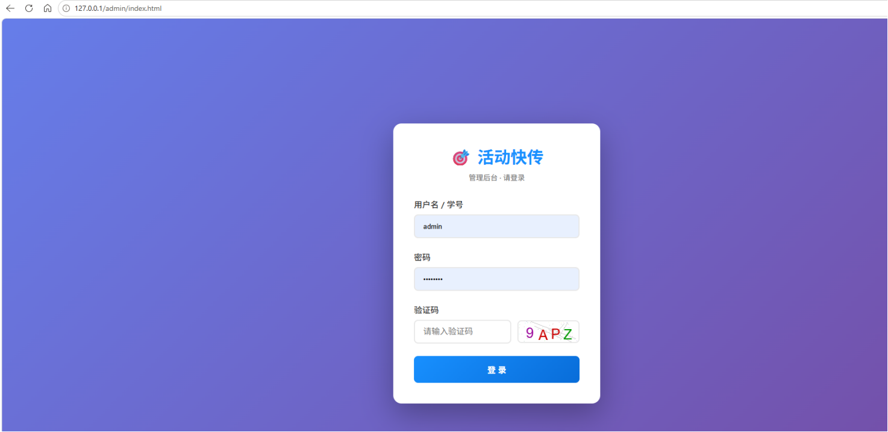

# 活动快传 (EventCast MQTT)

<div align="center">
  <h3>🎯 轻量级校园活动管理系统</h3>
  <p>基于 MQTT 实现实时通信</p>
</div>

## 项目简介

**活动快传**是一个轻量级的校园活动管理系统，旨在解决传统活动管理中通知遗漏、签到缓慢、统计繁琐等痛点。系统基于 MQTT 通信协议构建，实现了实时消息推送，确保所有客户端能够即时收到更新。

### 核心功能

- 📱 **微信小程序**：活动浏览、报名、签到
- 🖥️ **Web管理后台**：活动管理、数据统计、签到管理
- 🔄 **实时通信**：基于 MQTT 的消息推送
- 📊 **数据统计**：活动报名、签到数据实时分析
- 🎯 **智能签到**：二维码扫码签到

## 技术栈

### 后端
- **FastAPI**：高性能异步Web框架
- **MongoDB**：NoSQL数据库（Motor 异步驱动）
- **MQTT (EMQX)**：实时消息通信（Paho-MQTT 客户端）
- **Python 3.9+**：后端开发语言
- **python-jose**：JWT 认证与加密
- **Bcrypt**：密码安全哈希

### 前端
- **微信小程序**：用户端
- **HTML5 + CSS3 + JavaScript**：Web管理后台
- **Chart.js**：数据可视化
- **QRCode.js**：二维码生成

## 系统架构

```
┌─────────────────┐       ┌─────────────────┐       ┌─────────────────┐
│  微信小程序       │       │  Web管理后台     │       │  MQTT客户端      │
└────────┬────────┘       └────────┬────────┘       └────────┬────────┘
         │                         │                         │
         ▼                         ▼                         ▼
┌─────────────────┐       ┌─────────────────┐       ┌─────────────────┐
│  RESTful API    │◄──────┤  FastAPI后端     │──────►│  MQTT发布/订阅   │
└─────────────────┘       └─────────────────┘       └─────────────────┘
                                  │                         │
                                  ▼                         ▼
                         ┌─────────────────┐       ┌─────────────────┐
                         │  MongoDB数据库   │        │  EMQX MQTT代理   │
                         └─────────────────┘       └─────────────────┘
```

## 目录结构

```
eventcast-mqtt/
├── backend/              # 后端代码
│   ├── api/              # API路由
│   │   ├── events.py     # 活动管理接口
│   │   ├── signin.py     # 签到管理接口
│   │   ├── users.py      # 用户管理接口
│   │   └── logs.py       # 日志管理接口
│   ├── models/           # 数据模型
│   │   ├── event.py      # 活动模型
│   │   ├── user.py       # 用户模型
│   │   ├── signin.py     # 签到模型
│   │   └── log.py        # 日志模型
│   ├── utils/            # 工具函数
│   │   ├── auth.py       # 认证工具
│   │   ├── database.py   # 数据库连接
│   │   ├── mqtt_client.py# MQTT客户端
│   │   ├── captcha.py    # 验证码生成
│   │   ├── log_utils.py  # 日志工具
│   │   └── logging_config.py # 日志配置
│   ├── scripts/          # 初始化脚本
│   ├── main.py           # 主应用入口
│   └── requirements.txt  # 后端依赖包
├── webadmin/             # Web管理后台
│   ├── css/              # 样式文件
│   ├── js/               # JavaScript脚本
│   ├── index.html        # 登录页面
│   ├── dashboard.html    # 数据看板
│   ├── events.html       # 活动管理
│   ├── attendees.html    # 报名人员管理
│   ├── qrcode.html       # 签到二维码
│   ├── users.html        # 用户管理
│   ├── logs.html         # 日志查看
│   ├── license.html      # 许可证页面
│   └── config.js         # 配置文件
├── frontend/
│   └── miniprogram/      # 微信小程序
│       ├── pages/        # 页面
│       ├── utils/        # 工具函数
│       └── app.js        # 小程序入口
├── docs/                 # 项目文档
│   ├── API.md            # API文档
│   └── DEPLOYMENT.md     # 部署文档
├── .env.example          # 环境变量示例
├── requirements.txt      # 根目录依赖包
├── run.sh                # 启动脚本
├── LICENSE               # 许可证
└── README.md             # 项目说明
```

## 快速开始

### 1. 环境准备

- **MongoDB**：安装并启动MongoDB服务
- **EMQX**：安装并启动EMQX MQTT代理
- **Python 3.9+**：安装Python环境
- **微信开发者工具**：用于加载小程序项目

### 2. 安装部署

#### 克隆仓库

```bash
git clone https://github.com/fhgukhykgf/eventcast-mqtt.git
cd eventcast-mqtt
```

#### 安装依赖

```bash
pip install -r requirements.txt
```

#### 配置环境变量

```bash
cp .env.example .env
# 编辑.env文件，配置数据库和MQTT连接信息
```

#### 初始化数据库

```bash
cd backend
python scripts/init_database.py
```

#### 启动后端服务

```bash
cd backend
python -m uvicorn main:app --host 0.0.0.0 --port 8000 --reload
```
### 3. 访问系统

#### Web管理后台
- 配置Nginx反向代理后通过 http://127.0.0.1/admin/ 访问（推荐）
- 
- 或使用本地HTTP服务器（如 `python -m http.server 8080`）在 `webadmin/` 目录下启动

#### 微信小程序
- 使用微信开发者工具加载 `frontend/miniprogram` 目录
- 修改 `app.js` 中的 `baseUrl` 为你的服务器地址

#### Nginx配置示例

```nginx
# /etc/nginx/conf.d/eventcast.conf
server {
    listen 80;
    server_name your-domain.com;
    
    location /admin {
        alias /path/to/eventcast-mqtt/webadmin;
        index index.html;
        try_files $uri $uri/ /admin/index.html;
    }
    
    # 验证码接口
        location /captcha {
            add_header Access-Control-Allow-Origin "*";
            add_header Access-Control-Allow-Methods "GET, POST, OPTIONS";
            add_header Access-Control-Allow-Headers "Content-Type, Authorization";

            if ($request_method = OPTIONS) {
                return 204;
            }

            proxy_pass http://127.0.0.1:8000/api/users/captcha;
            proxy_set_header Host $host;
            proxy_set_header X-Real-IP $remote_addr;
        }
    
       location /api/ {
            add_header Access-Control-Allow-Origin "*";
            add_header Access-Control-Allow-Methods "GET, POST, OPTIONS";
            add_header Access-Control-Allow-Headers "Content-Type, Authorization";

            # 关键：OPTIONS 预检请求直接在 Nginx 返回 204，不转发到后端
            if ($request_method = OPTIONS) {
                return 204;
            }

            proxy_pass http://127.0.0.1:8000/api/;
            proxy_set_header Host $host;
            proxy_set_header X-Real-IP $remote_addr;
        }
}
```

## 默认账号

> ⚠️ 以下账号仅用于开发/测试环境，生产环境请务必修改默认密码！

| 角色 | 用户名         | 密码 | 说明 |
|------|-------------|------|------|
| 学生 | 20230001    | 123456 | 测试学生账号 |
| 学生 | 20230002    | 123456 | 测试学生账号 |
| 组织者 | O2023001 | 123456 | 可创建管理活动 |
| 管理员 | admin       | admin123 | 系统管理员 |

## MQTT主题结构

- `event/{event_id}/notice`：活动相关通知（创建、更新、提醒）
- `event/{event_id}/sign_in`：实时签到数据同步
- `user/{user_id}/notice`：用户个人通知
- `system/broadcast`：系统级广播

## 数据库设计

### 活动表
- 存储活动的基本信息，如标题、时间、地点、组织者、人数限制等

### 用户表
- 存储用户的登录信息、个人资料和角色权限

### 报名表
- 记录用户对活动的报名情况

### 签到表
- 记录用户的签到时间和方式

### 日志表
- 记录操作日志和登录日志，包含操作类型、目标对象、IP地址等

## 贡献指南

1. Fork 本仓库
2. 创建特性分支 (`git checkout -b feature/AmazingFeature`)
3. 提交更改 (`git commit -m 'Add some AmazingFeature'`)
4. 推送到分支 (`git push origin feature/AmazingFeature`)
5. 打开 Pull Request

## 许可证

本项目采用 MIT 许可证 - 详见 [LICENSE](LICENSE) 文件

## 联系方式

- 项目链接：https://github.com/fhgukhykgf/eventcast-mqtt

---

**活动快传** - 让校园活动管理更简单、更高效！ 🎯